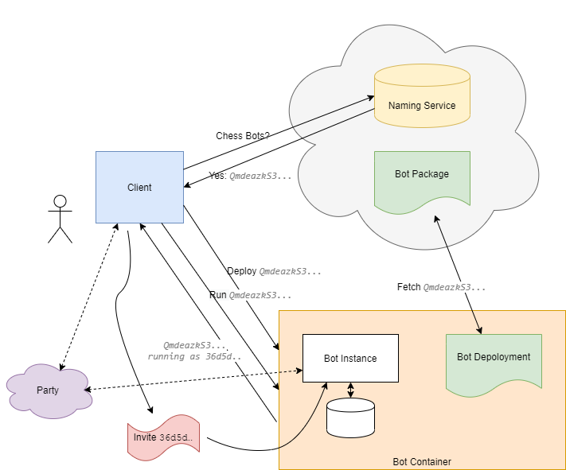

# Bots
TODO(dboreham): move this doc to the right place (/packages/botkit/doc?)

A Bot is a kind of application with the following properties:
1. It can be published in a Naming Service. What is being published is the application (its code and
metadata) rather than a deployment or running instance.
1. It can be deployed in a Bot Container. Upon deployment, the Bot Container has the capability to run one or more
 instances of the Bot.
1. The Bot Container can run an instance of the Bot. An instance can join one or more Parties. An instance can store
local persistent data such as files.  
1. An instance of a Bot is party-aware: it can be invited to and join parties, read and write party data.
## Bot Software Discovery
Registry client queries a Naming Service node, supplying metadata constraints: "Bot that plays Chess". 

Query results
include address (e.g. IPFS hash) of the Bot's packaged code (e.g. fetched as a file in npm format or some other
suitable software distribution package type such as [gx](https://github.com/whyrusleeping/gx)).
````javascript
query: type="dxn:bot" & protocol.id="QmdeazkS38aCrqG6qKwaio2fQnShE6RGpmNdqStLkkZcQN"

result:
  {
    "id": "QmSWPVupFYEbnADen6axgKhrkwTpM84Poej8MHvR8f57MR",
    "displayName": "Acme ChessBot",
    "name": "acme/chess-bot",
    "protocol": {
      "id": "QmdeazkS38aCrqG6qKwaio2fQnShE6RGpmNdqStLkkZcQN"
     },
    "package": {
      "ipfs": "QmXoypiejW3WknFiJnKLwHCnL72vedxjQkDDP1mXWo6ytr"
     },
     "type": "dxn:bot",
     "version": "2.0.96"
  }
````
The returned package address: `ipfs://QmXoypiejW3WknFiJnKLwHCnL72vedxjQkDDP1mXWo6ytr` can be
supplied to a Bot Container, see below.
## Bot Container
A Bot Container is a hosting environment for running Bot Instances, e.g. an XBox runs a Bot Container.
Bot Containers implement the Bot Container Protocol, which facilitates Bot Deployment and Bot Instance
creation.
## Bot Deployment
Bots are _deployed_ in a container using the Bot Container 
Protocol: 
```
request: deploy ipfs://QmXoypiejW3WknFiJnKLwHCnL72vedxjQkDDP1mXWo6ytr

response: "Acme ChessBot deployed on Bob's XBox"
```
A Bot must be deployed before an Instance 
can be created. Deployment is analogous to installing the Bot software in the Container. Bots may be un-deployed for 
example to recover storage 
space. In that event any Instances of the Bot would be destroyed.
## Bot Instance
An Instance of a Bot is a runnable duplicate of a Bot Deployment with its own Identity and persistent storage. 
Bot Instances are distinct from Bot Deployments to allow for multiple instances of the same Bot to 
exist in the same container. Example: "Work File Bot" and "Hobby File Bot".
## Bot Identity
A Bot Container has an Identity Key which is trusted by Container Protocol clients.

Bot Instances each have an Identity Key, certified by the Bot Container's Key.

The Bot Instance Identity Private Key is not required to spawn a Bot process or to
redeem an invitation for the Bot Instance into a party.
## Bot Instance Party Admission
Bot Instances can join one or more parties, via secure invitation from an existing Party Member.
The invitation's subject is the Bot Instance's Identity Key, obtained by the inviting
node from its container. Bot Instances redeem the invitation with an intermediate key
analagous to interactive users' Device Keys. For clarity, this is called a Bot Node Key but
is functionally identical to a Device Key and the term Device Key will be used throughout the documentation.
## Diagram
