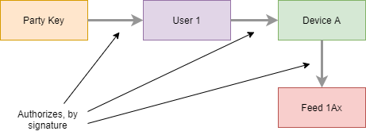
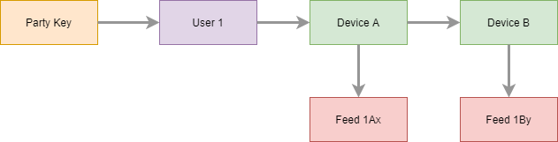
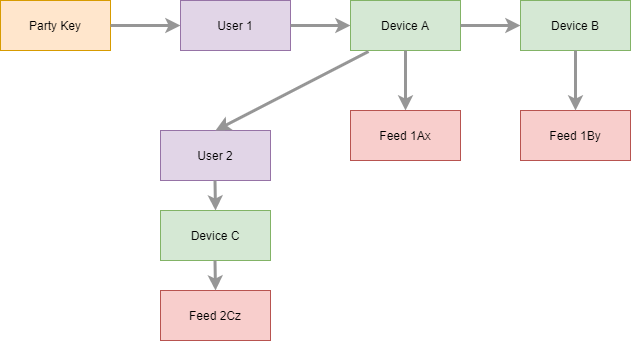
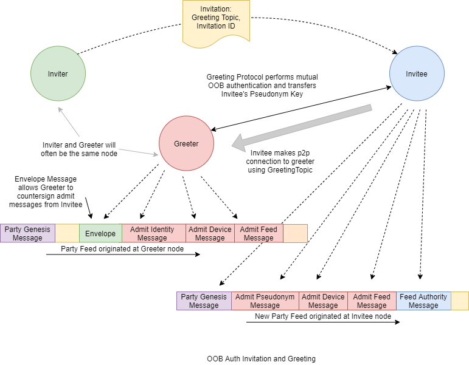
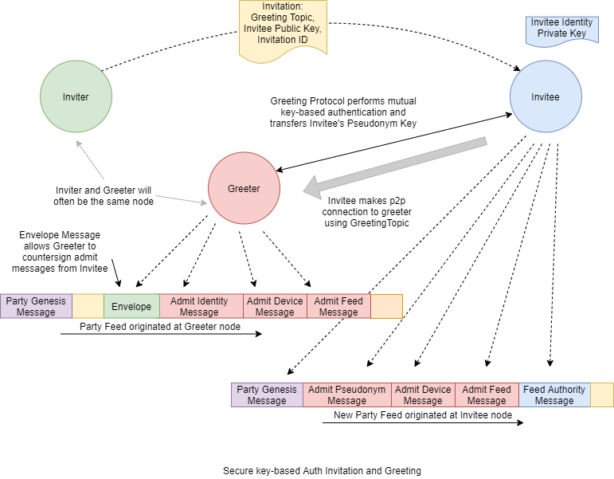
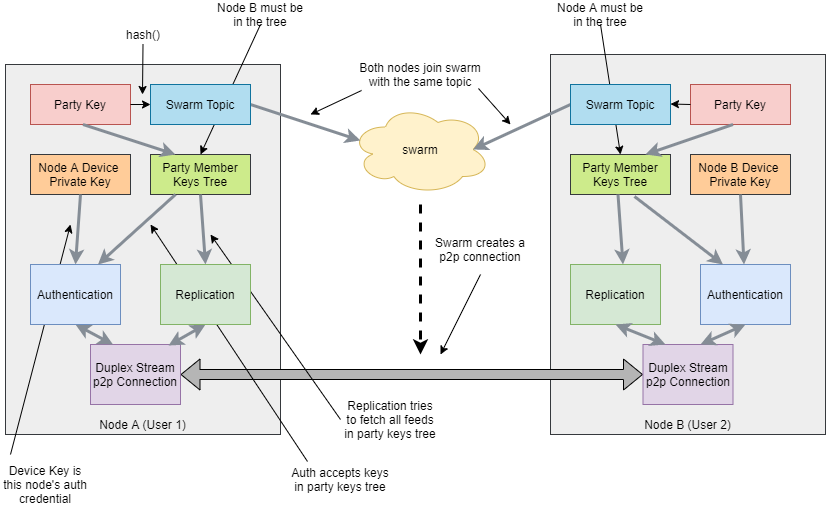
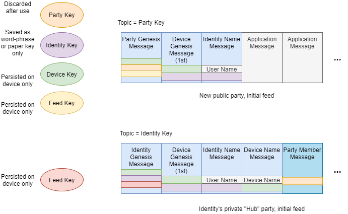
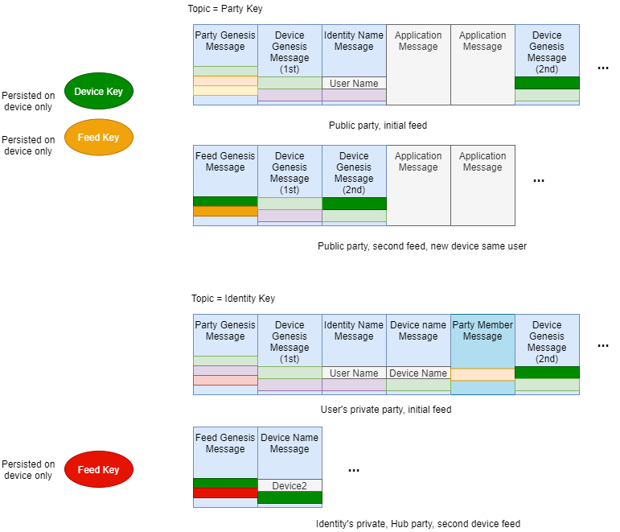
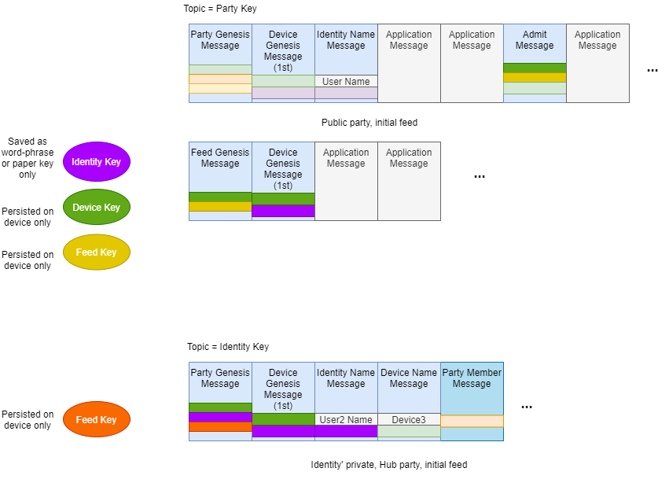

# Credential-Based Party
## Keys
The following key types are used:
 * **Identity**: Public/private keypair generated at user onboarding time.
 The root key for the user's certified device graph. Public key represents
 the user or entity within parties. Not stored on any device
 after signing initial user onboarding messages. Saved for use only to recover from
 loss of control over devices and key compromise.
 * **Device**: Public/private keypair generated at device onboarding time. 
 Private key stored only on the device. Device keys for a user comprise 
 a connected graph rooted in the Identity key. 
 * **Party**: An Inception Key. Public/private keypair generated when creating
 a new party. The root of authority for the party. Private key is discarded
 after signing party genesis message, delegating authority to the first 
 device and associated identity.
 * **Feed**: A Dat Feed public/private keypair. Private key stored only on its
 host device. Each feed key is unique to a (party,device) tuple.

## Protocols

### Party Construction

Nodes, knowing the Party Public Key, solicit peers advertising the key as a topic. Each node persistently maintains a 
set of feeds it previously knew to be in the party. It requests this set of feeds from each authenticated replication peer.
This feed set is initially bootstrapped in the Greeting protocol. 

New feeds belonging in the party are discovered by processing admit messages received on the previously known feeds.
Both Device Keys and Feed Keys are admitted. The identity keys associated with any admitted device keys are known 
as the members of the party. 
Admit messages are valid when their signing key is present in the known member set. Thus the members comprise a
tree with the party key as its root.

Initial Party Key Tree:

Party Key Tree after first user's second device provisioned:

Party Key Tree after a second user admitted:

//TODO(dboreham): reference party construction messages .proto

### Admission

A node may admit its own new feed by publishing a feed admit message on any existing party feed it controls.
A node may admit a new device by publishing a device admit message on any existing party feed it controls.
Such device admit messages are only valid if the new device is owned by the same identity key and therefore
any necessary device certification messages must be published also.

### Greeting

Greeting is a peer-to-peer protocol that facilitates secure party admission for an invitee where the invitee's
Device Key is not initially trusted. Trust is established via one of several authentication mechanisms. Admit
messages resulting from a Greeting session are signed by the invitee and countersigned by the greeter to
establish a clear chain of authority.  

//TODO(dboreham): reference greet messages .proto

### Replication Authentication

Replication sessions are scoped to a particular topic. Each peer authenticates the other by challenging for a proof of
control of a device key subordinate to a member key it knows to belong to the party associated with the topic.

//TODO(dboreham): reference auth messages .proto

### Halo

A "private" party is created for each user, with their identity key as the party key called an Halo.
The members of a private party are only the user's devices.
New devices are admitted via Greeting at an existing device.
The purpose of the private party is to share among the user's devices the following:

 1. An identity name message, used to associate a friendly name ("Bob") with their Identity key.
 1. The user's device certification messages.
 1. The user's device name messages which allow devices to be associated with friendly names selected by the user.
 1. The set of parties currently joined by the user. 

### New User New Party
The diagram below shows the keys associated with a new user creating a new party along with
the initial public party feed and initial Halo feed and the messages published on those feeds.
In the credential messages the upper colored blocks denote the certified keys while the lower block denotes the signing key.

### Same User Second Device
The diagram below shows the keys associated with a second device owned by the same user along with
the initial and subsequent feeds and messages published on those feeds.

### Same Party Second User
The diagram below shows the keys associated with a new user joining the party created above
along with the relevant feeds and messages published on those feeds.

